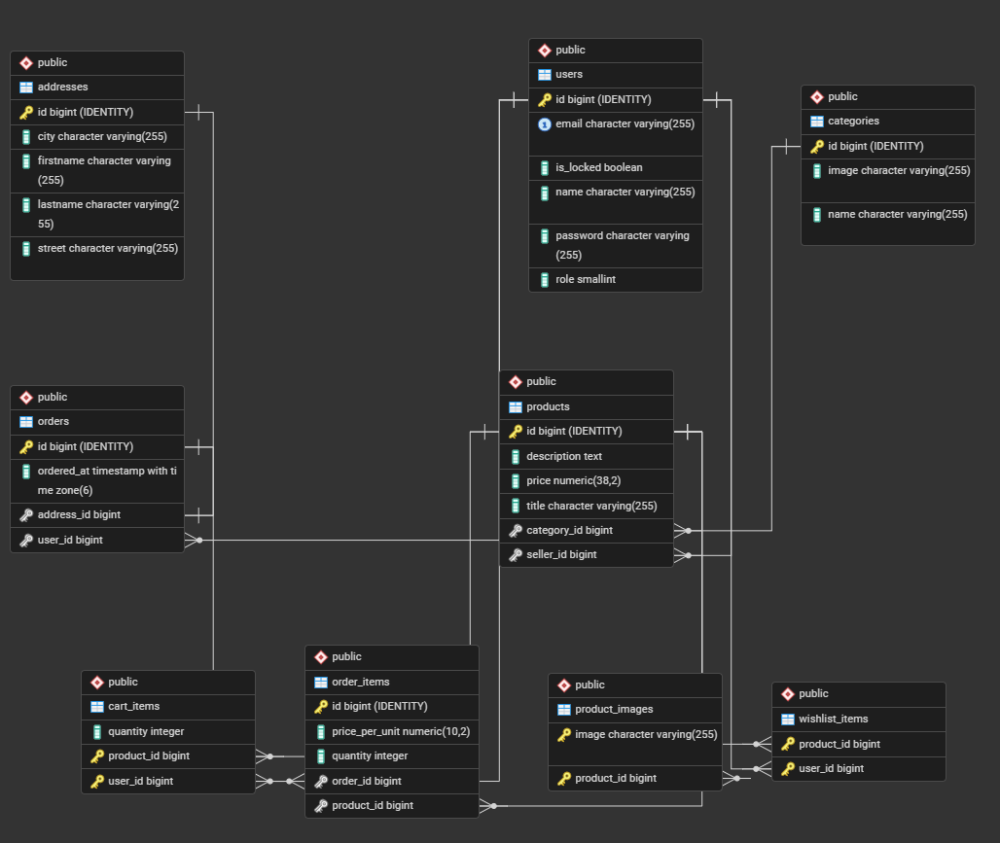
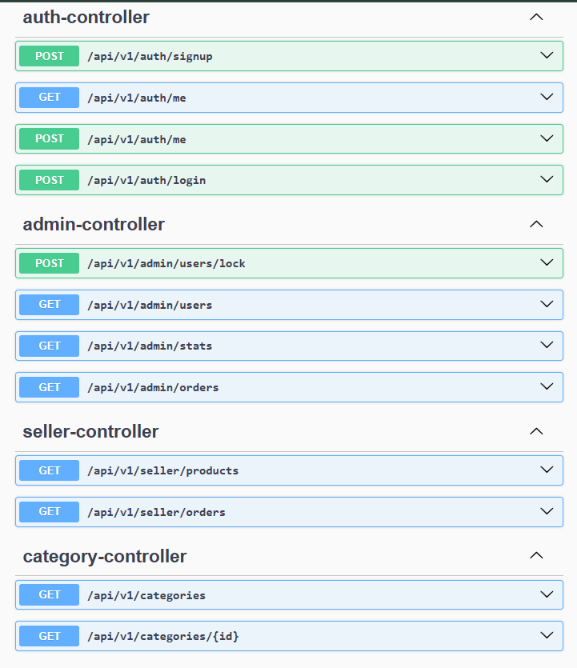
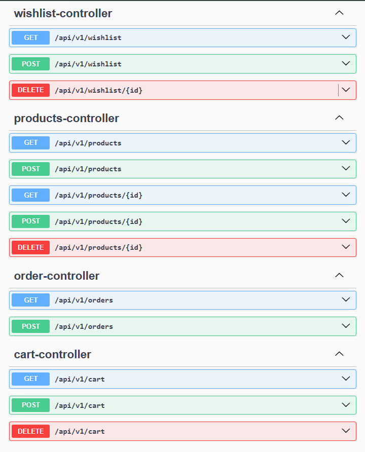

# ShopSphere E-Commerce Features

This document lists all the features available in the ShopSphere E-Commerce web application, based on the actions defined in the codebase.

## Build Instructions

After building the frontend and backend(Needs java 21) projects, make sure to:

Add .env in frontend folder with:

- NEXT_PUBLIC_API_URL - url to the backend (e.g. for local: http://localhost:8080)
- NEXTAUTH_SECRET - a secret value for next auth

Add .env in backend folder with:

- spring.datasource.url - JDBC URL to your PostgreSQL database (e.g. jdbc:postgresql://localhost/ecommerce)
- spring.datasource.username - your PostgreSQL username
- spring.datasource.password - your PostgreSQL password
- jwt.secret - a secret value for JWT signing
- admin.name - the default admin's account display name
- admin.email - the default admin's account email
- admin.password - the default admin's account password (e.g. 123456A)
- frontend.url - the URL of the frontend for CORS, or leave it empty in local development

## Database ERD

## Backend API

## Frontend Actions

### Authentication Features

- User Registration (`registerAction`)
- User Login (handled via NextAuth)
- Profile Update (`updateProfileAction`)
- Become a Seller (`becomeSellerAction`)

### Product Management Features

- Get All Products (Paginated) (`getAllProducts`)
- Get Product by ID (`getProductById`)
- Get Products by Category (`getProductsByCategory`)
- Search Products (`searchProducts`)
- Create Product (Seller) (`createProductAction`)
- Update Product (Seller) (`updateProductAction`)
- Delete Product (Seller) (`deleteProductAction`)

### Category Features

- Get All Categories (`getAllCategories`)
- Get Paginated Categories (`getPaginatedCategories`)
- Get Category by ID (`getCategoryById`)

### Cart Features

- Get Cart Items (`getCartAction`)
- Update Cart Item Quantity (`updateCartItemAction`)
- Clear Cart (`clearCartAction`)

### Wishlist Features

- Get Wishlist (`getWishlistAction`)
- Add to Wishlist (`addToWishlistAction`)
- Remove from Wishlist (`removeFromWishlistAction`)

### Order Features

- Get User Orders (`getOrdersAction`)
- Place Order (`placeOrderAction`)

### Admin Features

- Get Admin Statistics (`getAdminStatsAction`)
- Get Admin Users (`getAdminUsersAction`)
- Delete Admin User (`deleteAdminUserAction`)
- Get Admin Products (`getAdminProductsAction`)
- Delete Admin Product (`deleteAdminProductAction`)
- Get Admin Orders (`getAdminOrdersAction`)

### Seller Features

- Get Seller Products (`getSellerProductsAction`)
- Get Seller Orders (`getSellerOrdersAction`)

These features cover the core functionalities of the e-commerce platform, including user management, product browsing, shopping cart, wishlist, ordering, and administrative controls.
